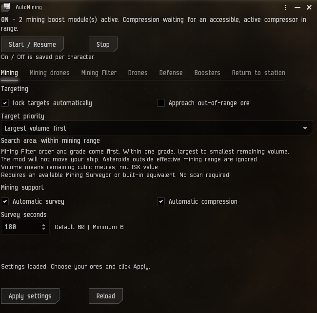
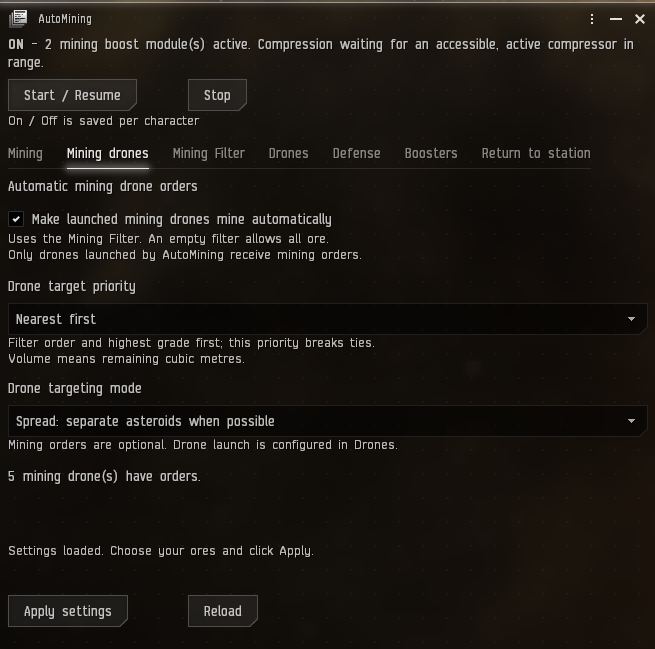
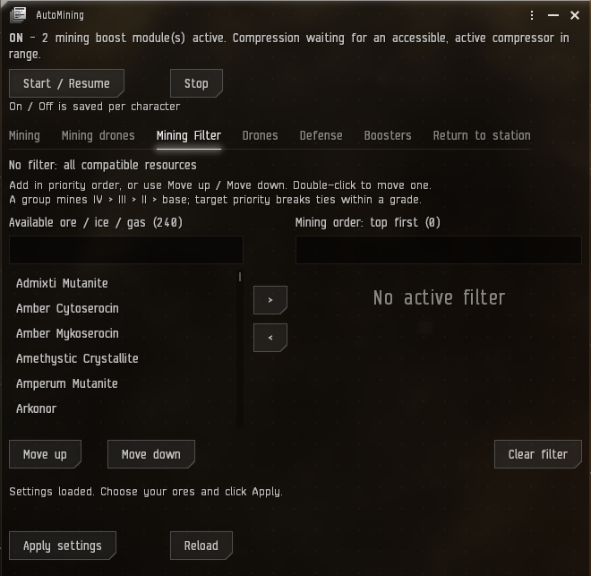
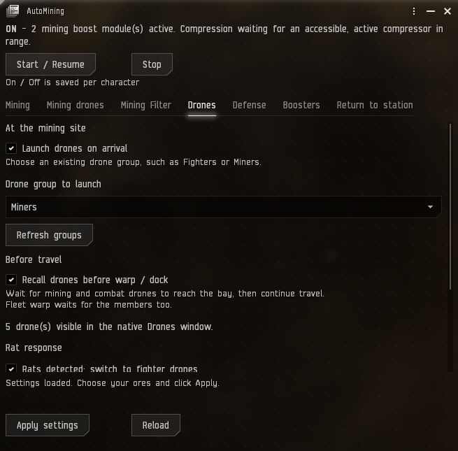
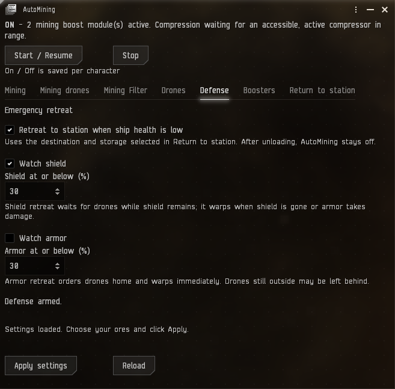
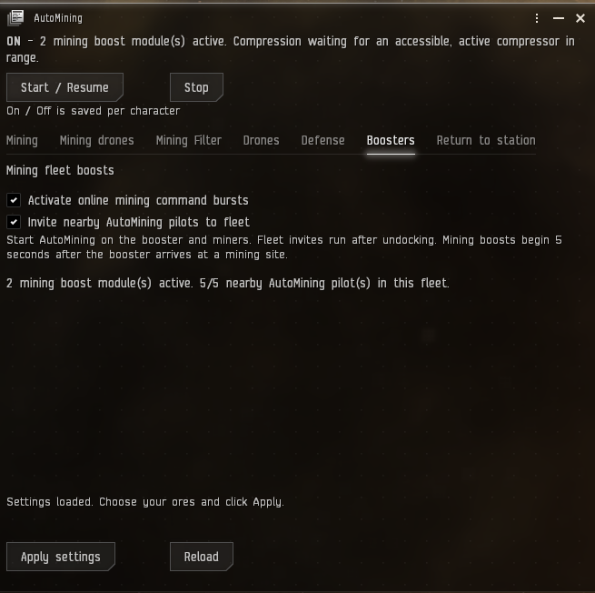
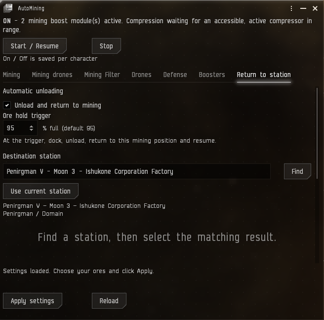

# AutoMining for EveJS

AutoMining mines ore, manages drones and fleet boosts, and can unload at a station before returning to mine. Settings are saved per character.

**Works with EveJS 0.12.8 and 0.12.9**, EVE client build 3396210, and [EveJS Launcher](https://github.com/V0nCleef/evejs-launcher) 1.0.61 or newer. Native and Launcher-managed Docker are supported.

The HUD follows your EVE client's language setting. It supports English, Simplified Chinese, German, French, Spanish, Italian, Russian, Japanese, and Korean. Station search accepts translated station names too.

## Install or update

1. Close your EVE clients and stop the EveJS server.
2. In the Launcher, use **Mods > AutoMining > Update**. For a new install, download [AutoMining-1.0.8.zip](https://github.com/V0nCleef/EveJS-Automining/releases/download/v1.0.8/AutoMining-1.0.8.zip) and use **Mods > Add ZIP**.
3. Restart the server and clients. Type `!automining` in chat to open the HUD. `/automining` also works for GM characters.

## What you can set

- **Mining Filter:** Choose ores in priority order. Each ore group mines its highest grade first.
- **Mining:** Choose target priority, automatic locking, approach, survey, and compression.
- **Mining drones:** Give launched mining drones their own target priority and Spread or Focus mode.
- **Drones:** Launch a named group on arrival, recall before travel, and switch to fighters when rats appear.
- **Defense:** Retreat to your selected station at your shield or armor threshold. After unloading, AutoMining stays off. An urgent armor retreat may leave drones behind.
- **Boosters:** Run mining command bursts and invite nearby AutoMining pilots to fleet.
- **Return to station:** Choose a station in any region and a storage destination, including corporation hangar divisions. The default unload trigger is 95% of the ore hold.

## HUD screenshots

Show all seven tabs

