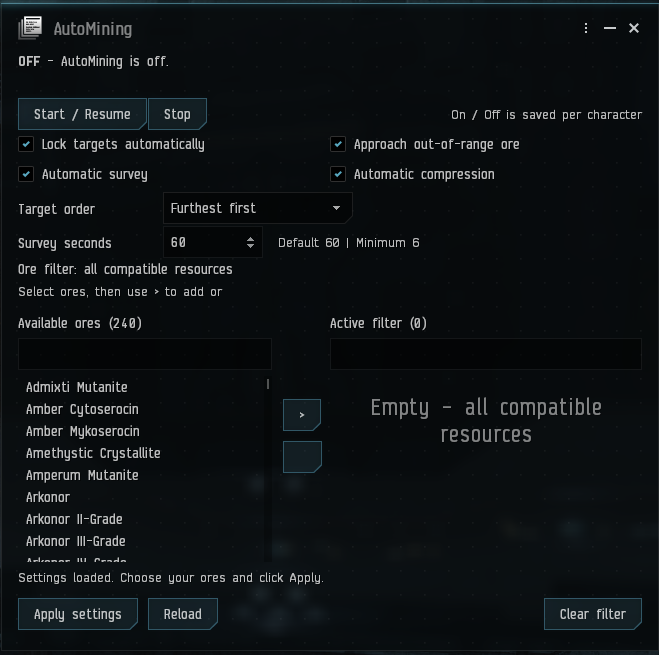

# AutoMining for EveJS

Automatic mining with an in-game settings window. Requires the **[EveJS Launcher](https://github.com/V0nCleef/evejs-launcher)**.

Your modules choose separate asteroids where possible. When there aren't enough suitable targets in reach, they share. Normal range, crystals, target limits, capacitor and hold capacity still apply.

**Current release: v1.0.7. Requires Launcher 1.0.61 or newer.**

The final paired update passed local Native in-game acceptance. See
[release validation](RELEASE-VALIDATION.md) for exact package hashes and coverage.

## Update

Existing users: update the Launcher to **1.0.61 or newer** first. Close your clients and stop the game server, then click **Update** for AutoMining in the Launcher's Mods page. Start the server and client again afterward. Saved settings are retained. The 1.0.7 transition uses this same Update action: the old helper restores its own archive entry, and the new helper configures login delivery on the reviewed native server. No extra migration button or settings reset is required.

Version 1.0.6 supports the reviewed original EveJS 0.12.8 mining runtime and the same runtime with the crystal-miner cancellation fix. On the original runtime, the included fix is applied in memory. On the patched runtime, the native fix is used without applying it twice. Both LF and CRLF source files are recognized. Unknown source changes remain blocked until reviewed; this does not promise compatibility with every future EveJS release. Ice cancellation behavior is unchanged.

## Install

Requires **EveJS Launcher 1.0.61 or newer**, **EveJS 0.12.8**, **Native or Launcher-managed Docker mode**, and the supported copied **EVE client build 3396210**.

1. Download `AutoMining-<version>.zip` from [Releases](https://github.com/V0nCleef/EveJS-Automining/releases). Choose the mod ZIP, not GitHub's Source code download.
2. Close all EVE clients and stop the EveJS server.
3. In the Launcher, open **Mods**, choose your EveJS installation, then **Add ZIP**.
4. Select the ZIP and enable **AutoMining**. The Launcher installs the included client companion.
5. Start the server and character through the Launcher.
6. Type `/automining` in chat to open settings. Choose your settings and click **Start / Resume**.

Undock with online mining modules and suitable resources nearby. The mod handles locking and mining. Use **Stop** in the window to turn it off.

Both **Native** and **Launcher-managed Docker** are supported from version 1.0.5. Choose the backend in the Launcher and install the mod through the same Mods page. For Docker, let the Launcher apply its mod mounts and recreate the server when prompted. The container must contain the supported EveJS 0.12.8 mining runtime; rebuild an outdated server image through the Launcher if needed. Connect-only Docker cannot install or change mods. This release uses login delivery on the reviewed native handshake build. Docker and unreviewed handshake builds retain the existing archive companion. A leftover legacy companion is detected so both methods cannot actively handle the same events. When a supported setup needs a missing legacy companion, Launcher 1.0.61 installs it automatically before preparing the profile. Close running clients before switching a shared installation; healthy additional client launches do not reinstall it. Compatibility enrollment includes AutoMining 1.0.6 in other server folders using the updated Launcher.

Settings live in the installation's `config` folder, mounted into the Docker server, so replacing the container or updating the mod keeps them. Separate EveJS installations keep separate settings.

## The settings window

Open it with `/automining`. Capital letters don't matter; `!automining` and plain `automining` also work.

- **Start / Resume** saves your choices and turns mining on. **Stop** turns it off.
- **Target priority:** nearest, furthest, largest volume or smallest volume first. The explanation underneath changes with your priority and Approach setting.
- **Lock targets automatically:** off means you must lock targets yourself.
- **Approach out-of-range ore:** on searches the whole current belt and travels to follow your priority; off searches only within each mining module's effective range. Active mining boosts count.
- **Automatic survey:** use the built-in Mining Surveyor at mining locations. It waits until undepleted ore, ice or gas is on your current grid. Set the interval in seconds.
- **Automatic compression:** compress resources aboard when a compressor your pilot can use is active and in range.
- **Apply settings:** save changes without changing whether AutoMining is on or off.
- **Reload:** discard unsaved changes and load the current saved settings.

### Target priority and Approach

| Example | What happens |
| --- | --- |
| Largest volume + Approach on | Chooses the largest matching asteroid across the current local belt, even if smaller asteroids are already reachable. It may fly from one end of the belt to the other. |
| Largest volume + Approach off | Chooses the largest matching asteroid within effective mining range. The mod does not move the ship. |
| Smallest volume | Reverses the volume order, using the same Approach rule. |
| Nearest / Furthest | Orders by surface distance, using the same Approach rule. |

Volume means **remaining cubic metres**, not ore units or ISK value. The ore filter and normal module/crystal compatibility always apply. **Largest/smallest volume requires an available Mining Surveyor or built-in equivalent.** No scan is required, and automatic survey can stay off. If the capability becomes unavailable, volume-priority mining pauses with an explanation and resumes when it returns. Nearest/furthest needs no Surveyor.

The primary asteroid stays selected until depleted or no longer eligible; the ship does not keep changing course as volumes or distances change. Other miners use separate compatible asteroids within reach where possible, sharing only when necessary. During normal automatic target selection, current cycles finish before travelling to a newly selected destination. Travel stays inside the current local scene/grid: the mod never warps to another belt or system.

**Changing priority takes effect immediately when you click Apply settings or use a priority command.** AutoMining stops its approach, interrupts mining cycles, unlocks the previous mining targets and cancels pending locks. It chooses again on the next automation tick (normally within one second), following the new priority, ore filter and Approach setting. Normal locking time still applies. With automatic locking off, you must lock new targets yourself. Saving the same priority again leaves current cycles alone. Interrupted cycles follow normal EveJS yield rules; forced target-loss stops may produce no partial yield. Manual ore-miner cancellation uses the short-cycle fix; ice cancellation behavior is unchanged.

Range comes from each module's native effective attributes, including skills, fitting and active mining boosts. Changes to active burst modifiers are checked on the one-second automation tick, including expiration. Approach distance adjusts to the compatible miners' effective ranges; ordinary fitting checks run every five seconds. Survey remains a separate, optional feature.

### Choose which ores to mine

The left list contains available resources. The right list is your active filter.

1. Search or select an ore on the left, then click **>** to add it.
2. Select an ore on the right and click **<** to remove it.
3. Click **Apply settings**.

Ctrl/Shift selects several entries. **Clear filter**, then **Apply settings**, allows every compatible resource again. An empty filter means mine all.

The list comes from the server's published resource catalog and includes ore, ice and gas. An ore family such as **Veldspar** also matches its named variants, including Dense Veldspar. Selecting a specific variant narrows that entry to the variant.

Applying a filter immediately unlocks excluded resource targets and stops their mining cycles. Matching targets keep working. Interrupted cycles follow normal EveJS yield rules; forced target-loss stops may produce no partial yield. Manual ore-miner cancellation uses the short-cycle fix; ice cancellation behavior is unchanged.

## Saved settings and defaults

Settings are saved separately for each character, including **On / Off**. If left on, AutoMining resumes after docking, logging back in or restarting the server when the character has a suitable ship in space. Travel and cloak pause it. Click **Stop** when you want it to stay off.

**Warping:** requesting warp immediately pauses automation and releases mining targets to stop current cycles. It leaves your warp command alone and keeps your On / Off choice. After landing, it resumes only when undepleted ore, ice or gas is on the current grid. If you cancel warp before leaving a mining site, mining resumes there. **This only happens while AutoMining is still On:** if it was already Off, or you press Stop during the trip, cancelling warp or landing cannot turn it back on.

| Setting | New-character default |
| --- | --- |
| AutoMining | Off |
| Ore filter | Empty: all compatible resources |
| Target priority | Nearest first |
| Automatic locking | On |
| Automatic survey | Off |
| Survey interval | 60 seconds |
| Automatic approach | Off |
| Automatic compression | Off |

**Updating the mod keeps saved settings.** Existing survey choices stay as you set them; changing the default does not turn a saved survey setting off.

To preconfigure a character, use **Mods > AutoMining > Configure**, choose its Launcher profile, enable **Apply Launcher settings**, then save. A changed preset applies at the next login. An unchanged preset will not overwrite later in-game choices.

## Useful details

**Full hold:** resource targets whose destination hold cannot accept another unit are unlocked, ending unnecessary cycles. Making space allows mining to resume automatically.

**Survey:** uses the same native Mining Surveyor action as the ship HUD button. Your ship must support it; Mining Survey chipsets keep their usual effects. With both AutoMining and survey on, scans run only when undepleted ore, ice or gas is present on your current grid. This covers asteroid belts, ice belts, gas sites and ore anomalies. Outside mining locations, or once a field is depleted, the HUD shows that survey is waiting. Landing at a mining location starts a new scan schedule, followed by your chosen interval. This presence check ignores your ore filter and laser range; the native Surveyor keeps its own result and range rules.

Allowed intervals are whole seconds from 6 to 86,400. Six seconds is the minimum because detailed scans have a native ten-per-minute limit; rapid arrivals or toggles cannot bypass that minimum. If the client is still finishing warp, entering space or running a survey, a rejected attempt is retried at that minimum instead of consuming the full interval. Arrival scanning can follow locking/mining by a few seconds. A successful attempt returns to the saved interval. Scanning pauses during travel. Changing the timer alone does not turn scanning on. Manual use of the Surveyor button is unchanged.

**Approach:** stays within the current scene; it does not travel to another belt or system. Manual steering switches automatic approach off.

**Compression:** checks every ten seconds while AutoMining is on. Normal access, fleet, range and resource restrictions apply. It uses an already active compressor and does not activate another ship's modules or fly toward it. The mining filter does not restrict compression of resources already aboard.

**Performance:** healthy cycles reuse existing targets instead of searching the entire field repeatedly. Empty searches retry every five seconds. The ore catalog is cached, and the window polls status only while open. Survey scanning follows its separate timer. Its location check reuses one known resource and checks it every five seconds or before a scan; empty locations retry every five seconds. Grid changes are detected on the automation tick. Turning survey off skips these location checks entirely.

Supports online mining lasers, strip miners, ice miners and gas harvesters. Mining drones are outside this mod's scope.

**Gas clouds:** search the resource filter for the gas name, such as **Fullerite-C50**, and add it with **>**, then Apply. Fit online gas harvesters to harvest matching clouds. Ore lasers cannot harvest gas. An empty filter allows every resource your fitted modules can harvest, including gas.

## Optional command shortcuts

You only need `/automining` to use the window. These shortcuts remain available, with `/`, `!`, or no prefix:

| Command | Action |
| --- | --- |
| `/automining` | Open settings |
| `/automining status` | Show settings and status as text |
| `/automining on` / `off` | Start or stop; saved per character |
| `/automining veldspar,scordite` | Replace the filter with these ores |
| `/automining clear` | Allow all compatible resources |
| `/automining nearest` / `furthest` | Change distance priority; immediately unlock old mining targets and choose again |
| `/automining largest` / `smallest` | Change remaining-volume priority; immediately unlock old mining targets and choose again |
| `/automining lock on` / `off` | Toggle automatic locking |
| `/automining approach on` / `off` | Toggle approach |
| `/automining survey on` / `off` | Toggle survey |
| `/automining survey 30` | Set a 30-second interval |
| `/automining compress on` / `off` | Toggle compression |

Aliases: `/automining closest` means nearest, `/automining farthest` means furthest, and `/automining survey interval 30` is the same as `/automining survey 30`. Replace `30` with your chosen whole number of seconds (6–86,400).

Settings commands leave the main On / Off choice unchanged. Commands provide a direct in-game notification as well as the chat acknowledgement when available.

## Updates and removal

The Launcher checks [this repository](https://github.com/V0nCleef/EveJS-Automining) for compatible releases. You can also use **Check mod updates** in Mods.

Close EVE clients and stop the server before updating, disabling or removing AutoMining. Install updates through the Launcher, then restart the server and clients. Your settings remain saved. The Launcher offers updates; it does not interrupt a running game to install them.

Disabling or removing an archive-based installation restores its original client module from backup. Login delivery has no new client archive patch to remove; stopping the server and client unloads the companion. Preferences remain available if you reinstall.

## Troubleshooting

- **No Configure button:** check Launcher version 1.0.57 or newer, install the correct package, then refresh Mods.
- **Window won't open or command feedback is missing:** fully restart both server and clients after updating. Launch through the Launcher. Use AutoMining's **Actions > Install / Update** with clients closed if the companion needs reinstalling.
- **Survey doesn't run:** enable both AutoMining and Automatic survey, check the window's status, and verify the ship can use its normal Mining Surveyor button.
- **Nothing is mined:** check online modules, filter, range, free hold space, capacitor and target slots. With locking off, lock a suitable resource yourself.
- **Compression waits:** a nearby ship alone isn't enough. Its compressor must be active, support your resource and be accessible to your pilot.
- **Unsupported build:** use the listed compatible server and client. Do not bypass compatibility checks.

Report problems in [GitHub Issues](https://github.com/V0nCleef/EveJS-Automining/issues). Include Launcher/EveJS versions, mining modules and `/automining status` output.
