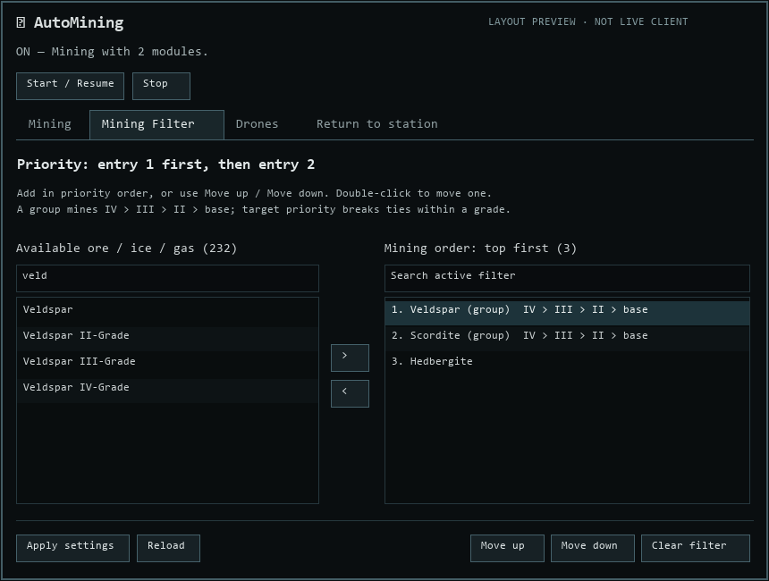

# AutoMining for EveJS

Automatic mining with an in-game settings window. Requires the **[EveJS Launcher](https://github.com/V0nCleef/evejs-launcher)**.

Your modules and mining drones choose separate asteroids where possible. On the same mining grid, AutoMining pilots prefer rocks that another pilot's modules or drones have not claimed. Each ship uses its own position, filter, range, and target priority; claims contain only rock IDs. When there aren't enough suitable targets, they share. Normal crystal, target, capacitor, and hold restrictions still apply.

**Version 1.0.8. Requires Launcher 1.0.61 or newer.**

Supports **EveJS 0.12.8 and official 0.12.9** with the same package.
The 0.12.8 mining fix is applied in memory when needed; 0.12.9 keeps its native
short-cycle implementation. Crystal checks use the fitting API shared by both
versions. Native login delivery is supported on both. Unknown mining or login
source revisions still require review; compatibility checks are not bypassed.

The fleet, drone, boosting, shared-target, unloading and return loop was
confirmed in game on 0.12.9. Shield and armor retreat were confirmed on both
supported EveJS versions. The current-station shortcut has automated coverage;
its separate live HUD check has not been recorded yet.

*Earlier settings window; version 1.0.8 has Mining, Mining drones, Mining Filter, Drones, Defense, Boosters and Return to station tabs.*

*Mining Filter layout preview for 1.1.7; this is a mock, not a live client capture.*

## Drones

The **Mining drones** tab is second. Enable automatic mining orders to make the
group launched by AutoMining mine ore from the Mining Filter. Empty filter means
all ore. Its separate priority selects rocks within the filter order and grade;
Spread gives drones different rocks when possible, while Focus sends them to the
same best rock. This is optional. The rat-response fighter group also attacks
detected rats; the native drone combat restrictions still apply.

Mining-drone claims are updated from current orders and released on recall,
departure, Stop, or ship change. Other pilots prefer unclaimed rocks within
the same ore-filter entry and grade, then share if needed. There is no extra
field scanner per drone.

Fleet warp now waits for every participating member with drone recall enabled
to have their drones in the bay before the commander warps the fleet. If a
return fails, the fleet warp is cancelled.

Open **Drones** in the HUD. Enable **Launch drones on arrival**, select an existing named group, then **Apply settings**. Use **Refresh groups** after changing groups in the normal drone window. If already at a mining location, **Start / Resume** also requests a launch. Applying settings alone does not relaunch a group that was already handled at this location.

The selected group launches once on arrival, including after an unloading trip. Version 1.1.3 waits up to 20 seconds for the client to finish landing before claiming the launch, then rechecks server authorization. A landing timeout appears in the Drones status; Start / Resume retries. Only members currently in this ship's drone bay are passed to the native launch command. Native ship limits apply. Group identity is preserved: deleting and recreating a group with the same name requires selecting it again. No alternate group is chosen automatically.

**Recall drones before warp / dock** is now on this same tab. It waits for controlled mining and combat drones to enter the bay, then continues the saved travel command. Already-returning drones receive no duplicate recall. Stop or a replacement destination cancels the old request. Version 1.1.2 fixes assembled drones being mistaken for missing drones because native inventory encodes their quantity as -1.

These controls cover named groups in the ordinary drone bay, including combat drones in a group named Fighters. Automatic mining and rat-attack orders are optional.

### Rat response

On **Drones**, enable **Rats detected: switch to fighter drones**, then select separate existing mining and fighter groups. When a belt or mining-site rat appears on the same grid, AutoMining recalls only drones in the selected mining group, waits for them to leave space, and launches the fighter group if needed. The fighters attack detected rats. After the rats leave for five seconds it recalls the selected fighter group and relaunches miners. A pilot whose standard arrival group is Fighters keeps those fighters out after the rats are gone.

### Boosters

On **Boosters**, enable **Activate online mining command bursts** to run AutoMining on a boosting ship without mining lasers. It activates fitted, online mining command burst modules using the native module cycle and requires their normal charges. Optionally enable **Invite nearby AutoMining pilots to fleet**: the booster invites other AutoMining-enabled clients on the same grid after undocking, before they warp to a mining site. This also runs during an ore-hauling return. Eligible clients accept automatically. The booster waits five seconds after arriving at a mining site before starting bursts, allowing other ships time to land. Existing fleet membership and unrelated pending invites are left alone. Stop deactivates boosts started by AutoMining; it does not disband an existing fleet. A booster ship using mining drones can also trigger its configured ore-hold return threshold without mining lasers.

## Automatic crystal adjustment

With AutoMining running and an ore filter selected, idle crystal-capable miners check their selected, eligible ore before activation. A crystal that already works for a selected ore stays loaded. Otherwise AutoMining tries a compatible crystal in the ship's normal cargo hold; if none is available, it unloads the incompatible crystal and resumes mining without one. Native crystal/module compatibility, inventory movement and reload timing apply.

Active cycles are not changed mid-cycle. Filter changes stop excluded mining targets through the existing native cancellation path. The HUD reports crystal loading or a failed unload (for example, insufficient cargo space). A crystal for a later filter entry no longer skips an earlier eligible entry; an incompatible crystal is changed or unloaded before the earlier ore is mined. No purchase or fitting change is performed.

## Update

Existing users: update the Launcher to **1.0.61 or newer** first. Close your clients and stop the game server, then click **Update** for AutoMining in the Launcher's Mods page. Start the server and client again afterward. Saved settings are retained. No settings reset is required.

Version 1.0.6 supports the reviewed original EveJS 0.12.8 mining runtime and the same runtime with the crystal-miner cancellation fix. On the original runtime, the included fix is applied in memory. On the patched runtime, the native fix is used without applying it twice. Both LF and CRLF source files are recognized. Unknown source changes remain blocked until reviewed; this does not promise compatibility with every future EveJS release. Ice cancellation behavior is unchanged.

## Install

Requires **EveJS Launcher 1.0.61 or newer**, **EveJS 0.12.8 or 0.12.9**, **Native or Launcher-managed Docker mode**, and the supported copied **EVE client build 3396210**.

1. Download `AutoMining-<version>.zip` from [Releases](https://github.com/V0nCleef/EveJS-Automining/releases). Choose the mod ZIP, not GitHub's Source code download.
2. Close all EVE clients and stop the EveJS server.
3. In the Launcher, open **Mods**, choose your EveJS installation, then **Add ZIP**.
4. Select the ZIP and enable **AutoMining**. The Launcher installs the included client companion.
5. Start the server and character through the Launcher.
6. Type `!automining` in chat to open settings. Choose your settings and click **Start / Resume**.

Undock with online mining modules and suitable resources nearby. The mod handles locking and mining. Use **Stop** in the window to turn it off.

Both **Native** and **Launcher-managed Docker** are supported. Choose the backend in the Launcher and install the mod through the same Mods page. For Docker, let the Launcher apply its mod mounts and recreate the server when prompted. The container must contain a supported EveJS 0.12.8 or 0.12.9 mining runtime; rebuild an outdated server image through the Launcher if needed. Connect-only Docker cannot install or change mods. Native uses login delivery on reviewed handshake builds. Docker and unreviewed handshake builds retain the existing archive companion. A leftover legacy companion is detected so both methods cannot actively handle the same events. Launcher 1.0.61 installs a missing legacy companion when needed. Close running clients before switching a shared installation.

Settings live in the installation's `config` folder, mounted into the Docker server, so replacing the container or updating the mod keeps them. Separate EveJS installations keep separate settings.

## The settings window

Open it with `!automining`. Capital letters don't matter. The EVE client reserves `/` commands for GM or other elevated roles, so a normal pilot's `/automining` may only show a green `slash: /automining` line without opening the window. Use `!automining` on normal characters.

The HUD uses the Eve client's active language when it opens. It includes English, Simplified Chinese, German, French, Spanish, Italian, Russian, Japanese and Korean labels and status messages. Station search accepts the station's name in any of these client languages and keeps the selected station's ID stable. Saved ore and drone group names are not translated. If you change the client language while the HUD is open, close and reopen it with `!automining` to update its labels. The tabs with longer forms scroll independently, while the status, tabs, and Apply/Reload controls stay visible.

- **Start / Resume** saves your choices and turns mining on. **Stop** turns it off.
- **Target priority:** nearest, furthest, largest volume or smallest volume first. The explanation underneath changes with your priority and Approach setting.
- **Lock targets automatically:** off means you must lock targets yourself.
- **Approach out-of-range ore:** on searches the whole current belt and travels to follow your priority; off searches only within each mining module's effective range. Active mining boosts count.
- **Automatic survey:** use the built-in Mining Surveyor at mining locations. It waits until undepleted ore, ice or gas is on your current grid. Set the interval in seconds.
- **Automatic compression:** compress resources aboard when a compressor your pilot can use is active and in range.
- **Apply settings:** save changes without changing whether AutoMining is on or off.
- **Reload:** discard unsaved changes and load the current saved settings.

### Target priority and Approach

| Example | What happens |
| --- | --- |
| Largest volume + Approach on | Chooses the largest matching asteroid across the current local belt, even if smaller asteroids are already reachable. It may fly from one end of the belt to the other. |
| Largest volume + Approach off | Chooses the largest matching asteroid within effective mining range. The mod does not move the ship. |
| Smallest volume | Reverses the volume order, using the same Approach rule. |
| Nearest / Furthest | Orders by surface distance, using the same Approach rule. |

Volume means **remaining cubic metres**, not ore units or ISK value. Saved filter order and grade come first; nearest/furthest/largest/smallest breaks ties within a grade. Normal module/crystal compatibility always applies. **Largest/smallest volume requires an available Mining Surveyor or built-in equivalent.** No scan is required, and automatic survey can stay off. If the capability becomes unavailable, volume-priority mining pauses with an explanation and resumes when it returns. Nearest/furthest needs no Surveyor.

The primary asteroid stays selected until depleted or no longer eligible; the ship does not keep changing course as volumes or distances change. Other miners use separate compatible asteroids within reach where possible, sharing only when necessary. During normal automatic target selection, current cycles finish before travelling to a newly selected destination. Travel stays inside the current local scene/grid: the mod never warps to another belt or system.

**Changing priority takes effect immediately when you click Apply settings or use a priority command.** AutoMining stops its approach, interrupts mining cycles, unlocks the previous mining targets and cancels pending locks. It chooses again on the next automation tick (normally within one second), following the new priority, ore filter and Approach setting. Normal locking time still applies. With automatic locking off, you must lock new targets yourself. Saving the same priority again leaves current cycles alone. Interrupted cycles follow normal EveJS yield rules; forced target-loss stops may produce no partial yield. Manual ore-miner cancellation uses the short-cycle fix; ice cancellation behavior is unchanged.

Range comes from each module's native effective attributes, including skills, fitting and active mining boosts. Changes to active burst modifiers are checked on the one-second automation tick, including expiration. Approach distance adjusts to the compatible miners' effective ranges; ordinary fitting checks run every five seconds. Survey remains a separate, optional feature.

### Choose which ores to mine

The left list contains available resources. The numbered right list shows the **actual mining priority, top first**.

1. Search or select an ore on the left, then click **>** to add it.
2. Add more entries in the order you want them mined. Double-click moves one entry between lists; **Move up** and **Move down** change the priority.
3. Click **Apply settings**.

Ctrl/Shift selects several entries; a batch is added in the visible list order. **Clear filter**, then **Apply settings**, allows every compatible resource again. An empty filter means mine all.

The list comes from the server's published resource catalog and includes ore, ice and gas. A family such as **Veldspar (group)** matches its named variants. Its grade order is **IV → III → II → base**; the right list shows that order next to the group. The separate **Veldspar** entry selects only its base/0-grade variant. If several entries are selected, the first matching entry wins. Modules still prefer separate compatible rocks within the same priority; when there are too few, they may use the next eligible entry or share.

Applying a filter immediately unlocks excluded resource targets and stops their mining cycles. Matching targets keep working. Interrupted cycles follow normal EveJS yield rules; forced target-loss stops may produce no partial yield. Manual ore-miner cancellation uses the short-cycle fix; ice cancellation behavior is unchanged.

## Saved settings and defaults

Settings are saved separately for each character, including **On / Off**. If left on, AutoMining resumes after docking, logging back in or restarting the server when the character has a suitable ship in space. Travel and cloak pause it. Click **Stop** when you want it to stay off.

**Warping:** requesting warp immediately pauses automation and releases mining targets to stop current cycles. It leaves your warp command alone and keeps your On / Off choice. After landing, it resumes only when undepleted ore, ice or gas is on the current grid. If you cancel warp before leaving a mining site, mining resumes there. **This only happens while AutoMining is still On:** if it was already Off, or you press Stop during the trip, cancelling warp or landing cannot turn it back on.

| Setting | New-character default |
| --- | --- |
| AutoMining | Off |
| Ore filter | Empty: all compatible resources |
| Target priority | Nearest first |
| Automatic locking | On |
| Automatic survey | Off |
| Survey interval | 60 seconds |
| Automatic approach | Off |
| Automatic compression | Off |
| Automatic hauling | Off |
| Ore hold return trigger | 95% full, configurable from 1% to 100% |

**Updating the mod keeps saved settings.** Existing survey choices stay as you set them; changing the default does not turn a saved survey setting off.

To preconfigure a character, use **Mods > AutoMining > Configure**, choose its Launcher profile, enable **Apply Launcher settings**, then save. A changed preset applies at the next login. An unchanged preset will not overwrite later in-game choices.

## Recall drones before departure

The Drones tab has **Recall drones before warp / dock**, enabled by default and saved per character. It works even when mining is Off. Manual ship warp and docking requests wait for your controlled drones to return to the bay. This includes mining and combat drones; carrier fighter squadrons use a separate system and are not covered. AutoMining's hauling autopilot also waits for drones before departure. Unrelated autopilot trips, fleet-imposed warp and special gate/filament/agent travel are not new protected entry points.

AutoMining pauses its mining work, holds the ship, issues the normal return-to-bay command once, and checks actual bay inventory before allowing the original travel request. Drones already returning under Alternate Mining Drones are not recalled again. The other mod and native drone movement/inventory are unchanged.

Stop, steering or a replacement destination invalidates the old pending request. Disconnect, ship change, another drone order, recall refusal or a three-minute timeout cancels travel. Missing drones do not count as successfully returned. To intentionally travel without this protection, disable the checkbox, apply, then issue travel again. Disabling it cancels a pending request instead of releasing that request unexpectedly.

The return-to-belt leg also stops waiting for temporary gate cloak to expire: it immediately requests normal native warp once no warp is in progress. Native fitted-cloak restrictions remain enforced. A pending landing handoff is retried on the next poll.

## Defense retreat

In **Defense**, enable emergency retreat and choose a shield or armor threshold. Both default to 30%; shield monitoring is selected by default and armor monitoring is optional. Set the destination and **Unload into** storage on **Return to station** first. Emergency retreat works even when automatic ore hauling is off. After docking, the ship unloads any ore it carries and AutoMining stays off. An unconfirmed transfer leaves the ship docked with AutoMining off.

A shield-triggered retreat orders drones home and waits while shield remains. If shield reaches zero or armor takes damage, it starts warp even if drones remain outside. The normal recall wait also has a three-minute cap. An armor-triggered retreat orders drones home and starts warp immediately; armor wins if both thresholds fire. Drones left outside may be lost. Warp still needs the game's normal alignment and can be blocked by disruption.

## Automatic ore hauling

Open `!AutoMining` and choose **Return to station**. Paste the station name, click **Find**, select the matching station/system/region, then choose **Unload into**. If docked, **Use current station** selects that station immediately. The list includes your personal item hangar, assembled personal containers there, and corporation hangar divisions you can query at an active corporation office. Actual transfer permissions and container capacity still apply. Click **Refresh storage** after changing containers or roles.

Enable **Unload and return to mining**, set **Ore hold trigger** (1–100%, default 95%), then **Apply settings**. This runs only while AutoMining is on. Applying it while already above the threshold can start a trip on the next hold check. The ore picker is on the **Mining Filter** tab; switching tabs keeps unsaved changes. Saved filters keep their original internal names and order.

If no selected, compatible ore unit fits in the remaining space, hauling can also begin before the chosen percentage. This prevents a ship from sitting with an unusable sliver of hold space.

The full cycle is: save mining position → pause mining → native autopilot to the station → dock → transfer the ore hold to the chosen storage → verify the deposit → undock → native autopilot to the original system → warp/approach the saved coordinates → resume mining. The feature remains armed for the next configured threshold. Return arrival is within 250 metres of the saved point. If automatic compression frees enough space first, mining continues without a trip.

Station search spans all regions. Native route preferences and docking/undocking rules apply. Existing waypoints are restored only while the temporary route still belongs to AutoMining. An already running autopilot is not taken over. Stop, Cancel return, manual steering/warp, changed waypoints or turning off autopilot cancel the trip and leave mining paused. Closing the HUD does not stop a trip.

Missing storage, denied transfers, partial unloads or unconfirmed deposits leave the ship docked. No fallback destination is chosen. Reconnecting or restarting during a trip requires explicit Start / Resume; a stale journey is never replayed automatically.

This first version covers ordinary belts and public-space mining positions with an asteroid or general mining hold. Cargo-only ships and dedicated gas/ice holds do not trigger it. Gated/instanced sites pause before departure because returning through their access gates is not implemented. No route jump-count preview is included. A depleted field follows the existing mining behavior after return.

## Useful details

**Full hold:** resource targets whose destination hold cannot accept another unit are unlocked, ending unnecessary cycles. Making space allows mining to resume automatically.

**Survey:** uses the same native Mining Surveyor action as the ship HUD button. Your ship must support it; Mining Survey chipsets keep their usual effects. With both AutoMining and survey on, scans run only when undepleted ore, ice or gas is present on your current grid. This covers asteroid belts, ice belts, gas sites and ore anomalies. Outside mining locations, or once a field is depleted, the HUD shows that survey is waiting. Landing at a mining location starts a new scan schedule, followed by your chosen interval. This presence check ignores your ore filter and laser range; the native Surveyor keeps its own result and range rules.

Allowed intervals are whole seconds from 6 to 86,400. Six seconds is the minimum because detailed scans have a native ten-per-minute limit; rapid arrivals or toggles cannot bypass that minimum. If the client is still finishing warp, entering space or running a survey, a rejected attempt is retried at that minimum instead of consuming the full interval. Arrival scanning can follow locking/mining by a few seconds. A successful attempt returns to the saved interval. Scanning pauses during travel. Changing the timer alone does not turn scanning on. Manual use of the Surveyor button is unchanged.

**Approach:** stays within the current scene; it does not travel to another belt or system. Manual steering switches automatic approach off.

**Compression:** checks every ten seconds while AutoMining is on. Normal access, fleet, range and resource restrictions apply. It uses an already active compressor and does not activate another ship's modules or fly toward it. The mining filter does not restrict compression of resources already aboard.

**Performance:** healthy cycles reuse existing targets instead of searching the entire field repeatedly. Empty searches retry every five seconds. The ore catalog is cached, and the window polls status only while open. Survey scanning follows its separate timer. Its location check reuses one known resource and checks it every five seconds or before a scan; empty locations retry every five seconds. Grid changes are detected on the automation tick. Turning survey off skips these location checks entirely.

Supports online mining lasers, strip miners, ice miners and gas harvesters, plus optional automatic mining orders for launched mining drones.

**Gas clouds:** search the resource filter for the gas name, such as **Fullerite-C50**, and add it with **>**, then Apply. Fit online gas harvesters to harvest matching clouds. Ore lasers cannot harvest gas. An empty filter allows every resource your fitted modules can harvest, including gas.

## Optional command shortcuts

You only need `!automining` to use the window. Use `!` for every command below on a normal character. The EVE client handles `/` before AutoMining can see it and only sends slash commands for elevated roles; `/automining` is therefore not a general-user shortcut. Plain `automining` is also recognized by the mod's normal chat route.

| Command | Action |
| --- | --- |
| `!automining` | Open settings |
| `!automining status` | Show settings and status as text |
| `!automining on` / `off` | Start or stop; saved per character |
| `!automining veldspar,scordite` | Replace the filter with these ores |
| `!automining clear` | Allow all compatible resources |
| `!automining nearest` / `furthest` | Change distance priority; immediately unlock old mining targets and choose again |
| `!automining largest` / `smallest` | Change remaining-volume priority; immediately unlock old mining targets and choose again |
| `!automining lock on` / `off` | Toggle automatic locking |
| `!automining approach on` / `off` | Toggle approach |
| `!automining survey on` / `off` | Toggle survey |
| `!automining survey 30` | Set a 30-second interval |
| `!automining compress on` / `off` | Toggle compression |

Aliases: `!automining closest` means nearest, `!automining farthest` means furthest, and `!automining survey interval 30` is the same as `!automining survey 30`. Replace `30` with your chosen whole number of seconds (6 to 86,400).

Localized command names and verbs are accepted with the `!` prefix in any of the nine supported languages, regardless of the client's selected language. Ore names remain the game's resource names. Settings commands leave the main On / Off choice unchanged. Commands provide a direct in-game notification as well as the chat acknowledgement when available. Detailed text replies to chat commands are still generated in English by the server.

## Updates and removal

The Launcher checks [this repository](https://github.com/V0nCleef/EveJS-Automining) for compatible releases. You can also use **Check mod updates** in Mods.

Close EVE clients and stop the server before updating, disabling or removing AutoMining. Install updates through the Launcher, then restart the server and clients. Your settings remain saved. The Launcher offers updates; it does not interrupt a running game to install them.

Disabling or removing an archive-based installation restores its original client module from backup. Login delivery has no new client archive patch to remove; stopping the server and client unloads the companion. Preferences remain available if you reinstall.

## Troubleshooting

- **No Configure button:** check Launcher version 1.0.57 or newer, install the correct package, then refresh Mods.
- **Window won't open or command feedback is missing:** use `!automining`, especially on a normal non-GM character. A green `slash: /automining` line means EVE handled `/` locally without sending the command to AutoMining. If `!automining` also fails, fully restart both server and clients after updating. Launch through the Launcher. Use AutoMining's **Actions > Install / Update** with clients closed if the companion needs reinstalling.
- **Survey doesn't run:** enable both AutoMining and Automatic survey, check the window's status, and verify the ship can use its normal Mining Surveyor button.
- **Nothing is mined:** check online modules, filter, range, free hold space, capacitor and target slots. With locking off, lock a suitable resource yourself.
- **Compression waits:** a nearby ship alone isn't enough. Its compressor must be active, support your resource and be accessible to your pilot.
- **Unsupported build:** use the listed compatible server and client. Do not bypass compatibility checks.

Report problems in [GitHub Issues](https://github.com/V0nCleef/EveJS-Automining/issues). Include Launcher/EveJS versions, mining modules and `!automining status` output.
